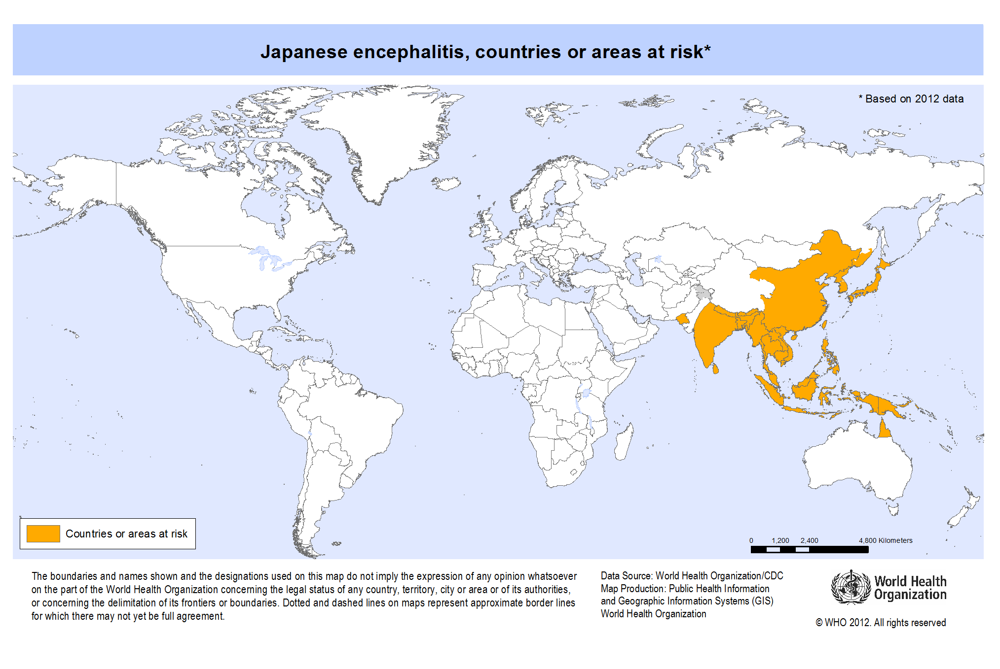
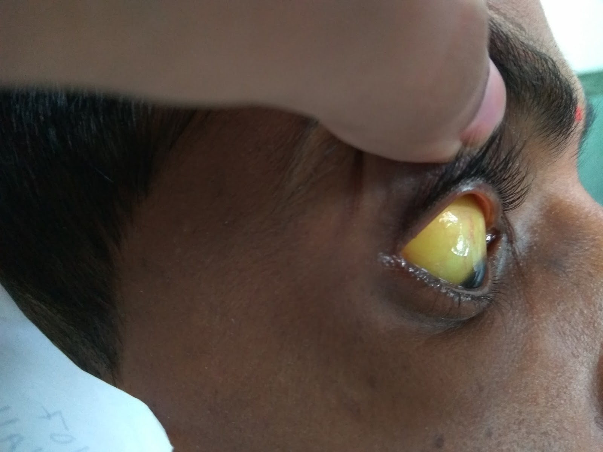
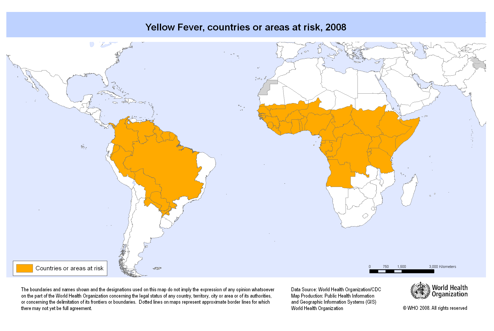
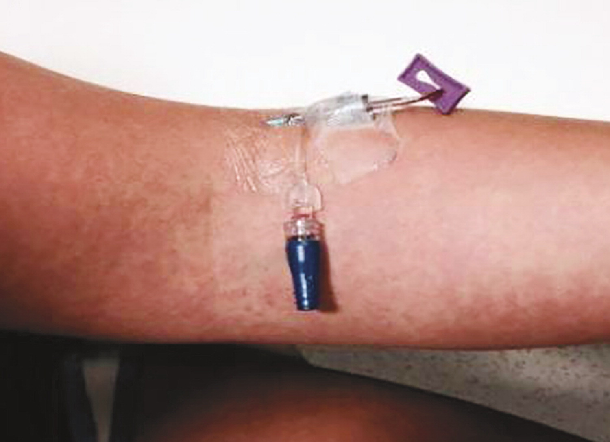
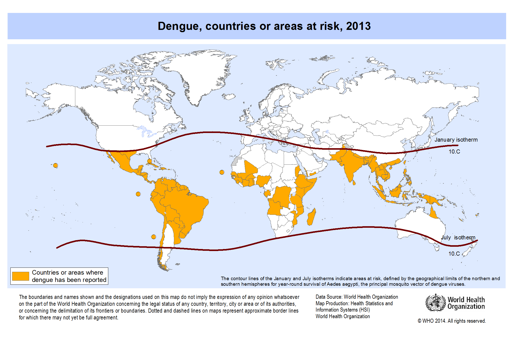

## Initial presentation

> - A 26 y/o presented to the ED in Toronto in early September with fever, myalgia, and headache. Headache started 3 days earlier. It was intermittent and was accompanied by some mild diplopia. She vomited twice yesterday and had no other GI symptoms. 

> - She recently returned from a trip to Thailand where she had bloody diarrhea about two weeks ago that resolved in a day with administration of an unknown antibiotic. Her trip was last minute and she did not consult a travel clinic. She had not traveled abroad previously. Most of her time in country was spent trekking through the forests and rice field areas.

> - No PMH 
    No PSH 
    No Meds 
    No allergies

---
## Objective information

> - On admission  
    PE: WNL 
    Labs: WBC = 12.3, Na = 124, Everything else WNL 
    Micro: Thick and thin smears negative

> - On 2nd day post-admission  
    PE: Diminished consciousness, neck stiffness, drooling, lower extremity stiffness

> - Blood:  
    Negative for CHIKV, rabies, herpes B, Snowshoe hare virus 
    Positive for Dengue IgM, WNV (1:10 titer)   
    LP: Leuks = 218, PMN = 52%, Protein = 82 mg/dL, Glucose = 78 mg/dL 
    PCR: Negative for bacterial, fungal, mycobacterial, HSV, EBV, WNV, adenovirus, and enterovirus 
    Rectal Swab: Positive for Salmonella paratyphi B 
    MRI: Normal

--- &vcenter

What does she have?

--- &vcenter
## JEV is found largely in the East Asia

--- &vcenter
## Further information about JEV

> - 

> - 

--- .segue
## Case #2

--- 
## Initial presentation

> - A 47 y/o American woman presents to the ED two days after returning from a trip to Sao Paulo, Brazil with her 13 y/o son. Three days ago she began feeling acutely ill with high fever, chill, frontal headache, back pain, and muscle pain. The next day she boarded a direct flight to Chicago. During the flight, she felt weak and developed a sore throat. Yesterday, she developed non-bloody diarrhea with nausea.

> - Since symptom onset she has been receiving amoxicillin and acetaminophen.

> - On physical exam, she is in acute distress. No signs of bleeding and a normal neuro exam.

> - Vitals are temperature of 35.6C, HR 60, BP 120/80

> - What do we think she has?

---
## More information

> - Platelets = 98K, WBC = 4K, Cr = 6.9, BUN = 151, AlkPhos = 228

> - ALT/AST = 23K/49K, Tbili = 3.5, Dbili = 2.6

> - PT = 26% normal, INR = 3.3, CRP = 13.8

> - What do we think she has?

--- &vcenter
## The next day her eye looks like this

--- &vcenter
## YF is found largely in S. America and Africa

--- .segue
## Case #3

---
## HPI
> - A 27-year-old woman was seen in the emergency department of this hospital during the summer because of arthralgias and a rash. She had just returned from a trip to Turks and Caicos.

> - The patient had been well until 5 days before this evaluation, when myalgias in her hands and shoulders developed, along with back pain, neck pain, and a retro-orbital headache.

> - Later that day, fever occurred (temperature, 39.0°C) and was accompanied by chills, nausea, decreased appetite, and sore throat. She also noted a vaginal ulcer, ulcers on the side of her tongue, decreased taste sensation, and enlarged, tender lymph nodes in her neck and groin. 

> - The next morning, the patient awoke with a rash on her right forearm. The lesions were pink, pruritic, and nonpainful. Within 1 hour, the rash spread to her torso and both arms and legs.

> - Her gums bled easily when she brushed her teeth, but the rash remitted.

> - On the fifth day of illness, a new pruritic, erythematous rash developed, beginning on her palms and spreading to her arms, chest, abdomen, back, and legs, sparing the soles of her feet.

---
## Objective information
> - The patient appeared well. The temperature was 36.4°C, the pulse 69 beats per minute, the blood pressure 135/87 mm Hg, the respiratory rate 18 breaths per minute, and the oxygen saturation 98% while she was breathing ambient air. 

> - There was subtle swelling of soft tissue in the hands but no joint effusions.

> - Tourniquet test was positive

> - __What do we have in the differential?__

--- &vcenter
## Rash spared the palm and soles

--- &vcenter
## Dengue is found everywhere JEV or YF is found

--- .segue
## Case #4

--- 
## Presentation and workup

> - A 45-year-old woman was seen in an outpatient clinic in Heidelberg, Germany for fever of up to 39°C and rash covering her trunk, arms, and legs.

> - Fever had started on 2 days previously, which was 6 days after she had returned from a 3-week vacation to peninsular Malaysia and Sabah, Malaysian Borneo.

> - Laboratory analyses showed a slightly elevated C-reactive protein level of 5.2 mg/L (reference range <5.0), but liver function test and complete blood count results were within reference range. 

> - During the next 3 days, the fever subsided, but the patient experienced a sore throat, bilateral conjunctivitis, and a burning sensation of the palms and soles. These symptoms were accompanied by swelling of the hands and increasing arthralgia of the wrists, palms, and fingers. There was no lymphadenopathy. 

> - Two days later, the patient experienced sudden bilateral dull and metallic hearing; in her left ear, she experienced a very short delay between a sound and her perception of the sound. 

> - What to do?

--- &vcenter

What does she have?

--- &vcenter
## Zika is found in much of the tropics

--- .segue
## Other flaviviruses

--- &vcenter
## Keep in mind there are other flaviviruses that are not necessarily tropical:

